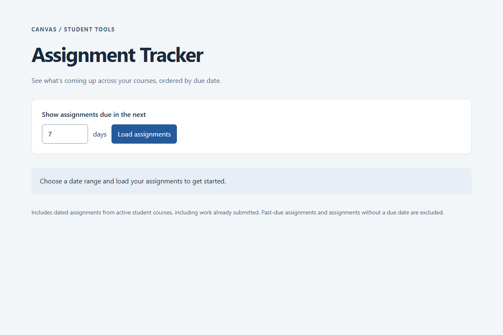

# Canvas Assignment Tracker

A small ASP.NET Core Blazor app written in C# that shows upcoming Canvas assignments across your active courses, sorted by due date. Color-coded urgency makes it easy to see what needs attention first.

## Setup Instructions

1. Install the [.NET 10 SDK](https://dotnet.microsoft.com/en-us/download/dotnet/10.0) and [Git](https://git-scm.com/). Choose the SDK, not just the runtime. Reopen your terminal after installation and run `dotnet --version` to confirm it is available.
2. Open a terminal and clone the repository:

   ```sh
   git clone https://github.com/Davisgrmn/cs408-minilab.git
   cd cs408-minilab
   ```

3. Restore the project using the .NET CLI (included with the SDK):

   ```sh
   dotnet restore
   ```

   The app uses the ASP.NET Core shared framework and requires no third-party NuGet packages.

4. Copy `.env.example` to `.env` (PowerShell: `Copy-Item .env.example .env`; macOS/Linux: `cp .env.example .env`). If you already have a `.env`, keep it. Set `CANVAS_API_TOKEN` to your personal Canvas token, generated under **Account → Settings → Approved Integrations → New Access Token**.

   ```dotenv
   CANVAS_API_TOKEN=your_token_here
   CANVAS_BASE_URL=https://boisestatecanvas.instructure.com
   ```

   Only the token is required. The other settings default to the values above. The token stays on the server, and `.env` is ignored by Git. Restart the app after changing environment variables.

5. Start the app:

   ```sh
   dotnet run
   ```

6. Open **http://localhost:5000**, enter a number of days from 1 to 365, and click **Load assignments**. Stop the server with Ctrl+C. To choose another port, use `dotnet run --urls http://localhost:5050`.

**NOTE**: If you are on onyx, please run the following commands on the terminal to install dotnet:

```sh
curl -sSL https://dot.net/v1/dotnet-install.sh | bash /dev/stdin --channel LTS
echo 'export DOTNET_ROOT=$HOME/.dotnet' >> ~/.bashrc
echo 'export PATH=$PATH:$HOME/.dotnet' >> ~/.bashrc
source ~/.bashrc
```

After installing dotnet, you are free to start on step 3.

## Usage Examples

- Enter **7** for assignments due over the next week.
- Enter **30** to plan the next month.
- Red means due within 24 hours; amber means within 3 days; green means later. Text labels also identify urgency.

The app includes already-submitted assignments if their deadlines are upcoming. Past-due work and assignments without a due date are excluded. Due dates appear in your browser's local time zone. If a course cannot be loaded, a warning identifies it and results from other courses remain visible. An empty result with warnings does not mean all courses are clear.

## Demo



This recording shows the initial form and invalid-date-range feedback, without personal Canvas data.

## API Endpoints Used

| Method | Endpoint | Purpose |
| --- | --- | --- |
| GET | `/api/v1/courses` | Retrieve active courses where you are enrolled as a student. |
| GET | `/api/v1/courses/:course_id/assignments` | Retrieve assignments and their due dates for each course. |

Both endpoints use `Authorization: Bearer <token>` and the Canvas-required `User-Agent: AssignmentTracker/1.0` header. Each list requests 100 items per page and follows Canvas's `Link` header until no `rel="next"` remains. Assignment requests use the due dates Canvas returns for the current student. The app only reads Canvas data.

References: [Canvas courses](https://developerdocs.instructure.com/services/canvas/resources/courses), [assignments](https://developerdocs.instructure.com/services/canvas/resources/assignments), and [pagination](https://developerdocs.instructure.com/services/canvas/basics/file.pagination).

## Verification

```sh
dotnet build
dotnet run --project tests/TrackerChecks.csproj
```

The dependency-free check runner uses fake Canvas responses without a real token. It covers pagination for both endpoint paths, bearer authentication, missing tokens, HTTP errors, network failures, timeouts, malformed JSON, unsafe pagination, date filtering and sorting, and partial course failures. To check the UI manually, load `/`, submit `7`, and visit `/?days=0` to confirm validation. Razor automatically HTML-encodes assignment and course names.

## Implementation

`Components/Pages/Home.razor` renders the form and table using Blazor static server rendering. `Services/CanvasClient.cs` handles REST requests and transforms results. `Services/EnvFile.cs` loads simple `KEY=value` entries, including quoted values, from `.env`; existing environment variables take precedence. The tiny script in `wwwroot/dates.js` formats dates in the browser's local time zone. No database or frontend package manager is needed.

## Reflection Draft

This project demonstrates how a small application can combine data from two REST endpoints into a useful view. The course list supplies IDs for assignment requests, and the returned JSON becomes a single table. Keeping the bearer token in the server environment lets the application authenticate without embedding a secret in browser code.

Pagination and dates require extra care. A successful first request does not necessarily contain the full list, so both endpoints follow the next-page links. Comparing timestamps before formatting them keeps the ordering consistent, while local formatting makes deadlines easier to read. Handling an inaccessible course separately also allows the rest of the results to remain useful.

